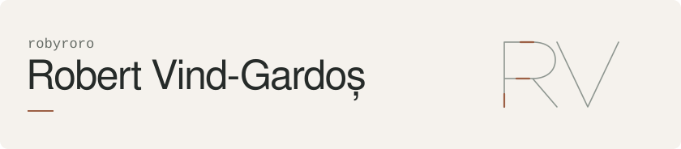

<picture>
  <source media="(prefers-color-scheme: dark)" srcset="./assets/profile-header-dark.svg" />
  <source media="(prefers-color-scheme: light)" srcset="./assets/profile-header-light.svg" />
  
</picture>

I'm Robert, a developer based in Bucharest. I co-founded [Recompensated](https://recompensated.com), where I'm CEO, and [STRAT Agency](https://stratagency.ro/en), where I work on websites, marketing and product.

My open-source work ranges from Assembly to tools for AI agents. Here are a few projects worth starting with.

## Selected projects

### [asmwatch](https://github.com/robyroro/asmwatch)

A Linux system monitor written in x86-64 Assembly. It reads `/proc` and talks to the kernel directly, with no libc or UI library.

Assembly · Linux · Direct system calls

### [PersonaMCP](https://github.com/robyroro/PersonaMCP)

Turns your own chat exports into writing context for AI agents. The archive and search stay on your machine; connected agents can retrieve relevant examples through MCP.

Python · SQLite · MCP

### [romania-mcp](https://github.com/robyroro/romania-mcp)

Romanian company records, court cases and exchange rates, available through MCP. Pulls from public sources without API keys.

Python · Public data · MCP

### [LibreReward Bridge](https://github.com/robyroro/libreward-bridge)

An experiment in distributing rewards through GNU Taler, with single-use claims, a tracked claim lifecycle and signed webhooks. Currently a research prototype.

TypeScript · PostgreSQL · GNU Taler

[More projects ↗](https://github.com/robyroro?tab=repositories)

## On the workbench

I'm also working on [Project Ghost](https://github.com/robyroro/project-ghost), a Chromium browser designed around separate browsing identities and stronger privacy defaults. It's still pre-alpha. The code, design decisions and remaining work are in the repository.

---

[About me](https://stratagency.ro/en/robert-vind-gardos) &nbsp;·&nbsp; [Get in touch](https://stratagency.ro/en/contact)
