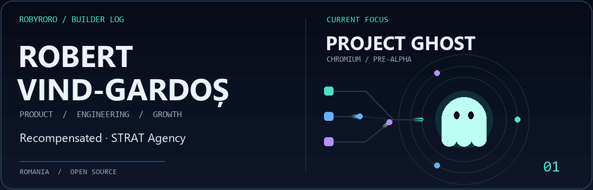
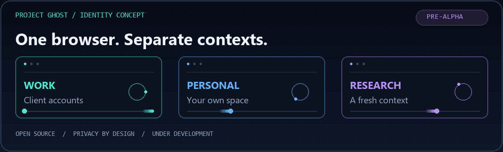
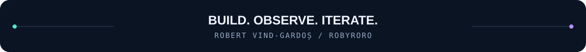

<p align="center">
  <a href="https://github.com/robyroro/project-ghost">
    
  </a>
</p>

<h1 align="center">Robert Vind-Gardoș</h1>
<p align="center">
  <b>Entrepreneur. Product builder. Open-source developer.</b><br />
  Co-founder and CEO at <a href="https://recompensated.com">Recompensated</a> · Co-founder at <a href="https://stratagency.ro">STRAT Agency</a><br />
  Based in Romania · Online as <a href="https://github.com/robyroro">@robyroro</a>
</p>

<p align="center">
  <a href="https://github.com/robyroro/project-ghost"><b>Project Ghost</b></a> &nbsp;/&nbsp;
  <a href="https://github.com/robyroro?tab=repositories">Repositories</a> &nbsp;/&nbsp;
  <a href="https://stratagency.ro/ro/robert-vind-gardos">About Robert</a> &nbsp;/&nbsp;
  <a href="https://stratagency.ro/ro/contact">Get in touch</a>
</p>

---

## 01 / Current focus — Project Ghost

<a href="https://github.com/robyroro/project-ghost">
  
</a>

**I'm building an open-source desktop browser on Chromium, with privacy by default and separate browsing identities as its core design goals.**

The idea: keep work, personal accounts, and research in distinct contexts, with protections built into the browser and temporary sessions that can be discarded when you're done.

**Status: pre-alpha, under active development.** Ghost is a working name. Development builds and early audit findings are documented; the planned privacy features are not all implemented, and this is not a public browser release. The animation above illustrates the design direction.

| Foundation | Planned experience | First platform |
| :--- | :--- | :--- |
| Chromium + custom C++ integration | Separate identities, disposable sessions, built-in protections | Windows 11 x64 |

**[Explore the repository →](https://github.com/robyroro/project-ghost)** &nbsp;·&nbsp; [Roadmap](https://github.com/robyroro/project-ghost/blob/main/docs/roadmap.md) &nbsp;·&nbsp; [Privacy model](https://github.com/robyroro/project-ghost/blob/main/docs/privacy-model.md) &nbsp;·&nbsp; [Architecture](https://github.com/robyroro/project-ghost/blob/main/docs/architecture.md)

[Read the project story on STRAT ↗](https://stratagency.ro/en/insights/project-ghost)

## 02 / Two sides of my work

<table>
  <tr>
    <td width="50%" valign="top">
      <h3>Recompensated</h3>
      <p><b>Co-founder and CEO · Product &amp; engineering</b></p>
      <p>A rewards platform connecting offers, surveys, cashback and referrals with real rewards.</p>
      <p>I work on the product, points economy, provider integrations, fraud prevention and the experience around earning and redeeming.</p>
      <p><a href="https://recompensated.com"><b>Visit Recompensated ↗</b></a></p>
    </td>
    <td width="50%" valign="top">
      <h3>STRAT Agency</h3>
      <p><b>Co-founder · Strategy &amp; execution</b></p>
      <p>A digital agency connecting marketing, design and technology.</p>
      <p>My work spans performance marketing, websites, SEO, creative direction, analytics and automation — from the first idea to the implementation.</p>
      <p><a href="https://stratagency.ro"><b>Explore STRAT ↗</b></a></p>
    </td>
  </tr>
</table>

## 03 / Open-source field notes

I build tools for security, public-data research and the small engineering problems that keep coming back. I like systems where you can inspect the evidence, reproduce the result and understand the limits.

| Project | The problem I'm working on |
| :--- | :--- |
| **[Project Ghost](https://github.com/robyroro/project-ghost)** | Privacy by default and separate browsing identities in a Chromium browser. **Current focus · pre-alpha.** |
| [MCP Sentinel](https://github.com/robyroro/mcp-sentinel) | A security control plane and policy gateway for Model Context Protocol deployments |
| [RegistryMesh EU](https://github.com/robyroro/registrymesh-eu) | Researching EU public-business data with traceable sources |
| [OpenLens](https://github.com/robyroro/openlens) | A passive OSINT investigation workbench built around evidence |
| [LibreReward Bridge](https://github.com/robyroro/libreward-bridge) | Single-use reward claims funded from GNU Taler, with lifecycle tracking and signed webhooks |
| [ScriptDrift](https://github.com/robyroro/scriptdrift) | Catching differences between commands in documentation and package scripts |
| [EnvDript](https://github.com/robyroro/envdript) | Catching differences between environment variables in code and `.env.example` |
| [Meta Ads Portfolio Intelligence](https://github.com/robyroro/meta-ads-portfolio-intelligence) | Exploring advertising portfolio data through a dashboard with synthetic demo data |

## 04 / My workbench

```text
CURRENT EXPLORATION   C++ · Chromium · browser privacy · Python build tooling
APPLICATIONS         PHP / Laravel · TypeScript · Node.js · Go · Python
INTERFACES           React · Next.js · Vue · HTML / CSS
INFRASTRUCTURE       Linux · Docker · Cloudflare · PostgreSQL · MySQL
BUSINESS             Product · performance marketing · SEO · analytics
```

**My approach:** build something useful, inspect how it behaves, document what holds up, and improve what doesn't.

## 05 / The contribution trail

<picture>
  <source media="(prefers-color-scheme: dark)" srcset="https://raw.githubusercontent.com/robyroro/robyroro/refs/heads/output/github-snake-dark.svg" />
  <source media="(prefers-color-scheme: light)" srcset="https://raw.githubusercontent.com/robyroro/robyroro/refs/heads/output/github-snake.svg" />
  
</picture>

---

<p align="center">
  <b>Follow the build.</b><br />
  <a href="https://github.com/robyroro/project-ghost">Project Ghost</a> &nbsp;·&nbsp;
  <a href="https://stratagency.ro/ro/robert-vind-gardos">My story</a> &nbsp;·&nbsp;
  <a href="https://stratagency.ro/ro/contact">Work with me</a>
</p>

<p align="center">
  
</p>
